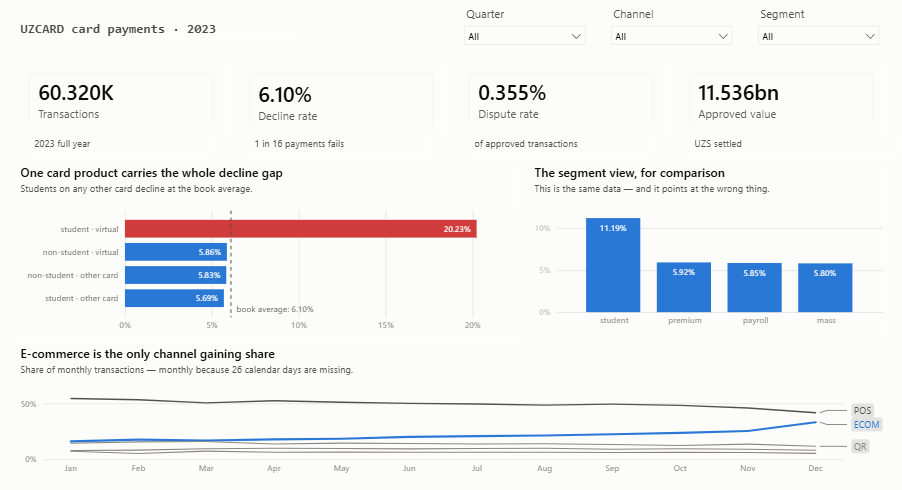

# Data analyst portfolio — Shahzod Bahronov

Four analyses of Uzbek fintech data, each ending in a decision rather than a chart.
One PostgreSQL database, four schemas, 1.67 million rows.

**PostgreSQL · Python · Power BI**

---

## The projects

### [UZCARD card payments — where the money leaks](uzcard-payments-analysis/) · complete

60,320 card transactions, 2023. Three findings, each of which contradicts the answer the
obvious `GROUP BY` gives.

There is no student problem — there is a virtual-card-for-students problem, and the
difference is a Simpson's paradox worth 16.2 mln UZS. The bank's own merchant risk label
does not merely fail; inside the categories that matter it runs backwards, and the
merchants it calls safest generate 4.3× the disputes of the ones it calls risky. And the
whole card-not-present dispute problem turns out to live in a five-hour window, which
turns "e-commerce is risky" into a rule that fires **once a day at 46.9% precision**
instead of forty times at 1.2%.

Ends in a three-page Power BI report built on a star schema, and both leaks priced in UZS
so they can be ranked against each other.



### [MerchantHub acquiring](merchanthub-acquiring/) · not started

Settlement and acquiring. The data-quality scan already found 871 approved transactions
that were never settled — 9.3% of the book, and not simply a mirror of the failed ones.
That is where this one starts.

### [OQPay super-app — funnel and root cause](oqpay-superapp-rootcause/) · not started

780,000 clickstream events. `product_id` is empty in 100% of them, so the funnel has to be
built on `event_type` alone and any product-level question answered from `order_items`
instead. The limitation is real and stated up front rather than worked around silently.

### [WalletApp — funnel and retention](walletapp-funnel-retention/) · not started

Cohort retention and activation.

---

## How the repo is arranged

```
setup/
  schema.sql               31 tables across four schemas
  load_data.py             CSV → PostgreSQL, truncating so a re-run replaces
  profile_data.py          the data-quality scan
  DATA-QUALITY.md          its findings — read before trusting any number here

<project>/
  README.md                the analysis, written as an argument
  sql/                     numbered files, each runs standalone and prints its results
  notebooks/               the same analysis with charts and significance tests
  dashboard/               star-schema views, build spec, theme, the report itself
  assets/                  charts and report screenshots
  data/raw/                CSV extracts — gitignored, see the project's data/README.md
```

## Setting it up

```bash
cp .env.example .env                 # then fill in PGPASSWORD
pip install -r requirements.txt
psql -d portfolio -f setup/schema.sql
python setup/load_data.py
python setup/profile_data.py
```

Raw CSVs are not versioned — they are course-issued data and would add megabytes of
unreviewable content to every clone. Each project's `data/README.md` lists the files it
expects and their row counts.

## A note on what these are

The data is generated, issued as coursework by Uzcard Academy. The analysis is not.
Every number in every README is reproducible from the SQL in the same folder, and the
dashboard's semantic layer ends in smoke tests that fail loudly if a view is edited into
disagreeing with the text.

Findings are stated with their limitations attached. Where a result rests on fifteen
merchants, the README says fifteen. Where a figure is exposure rather than booked loss,
it says so. A portfolio that only shows the flattering half of a finding is a portfolio
that has not been checked.
