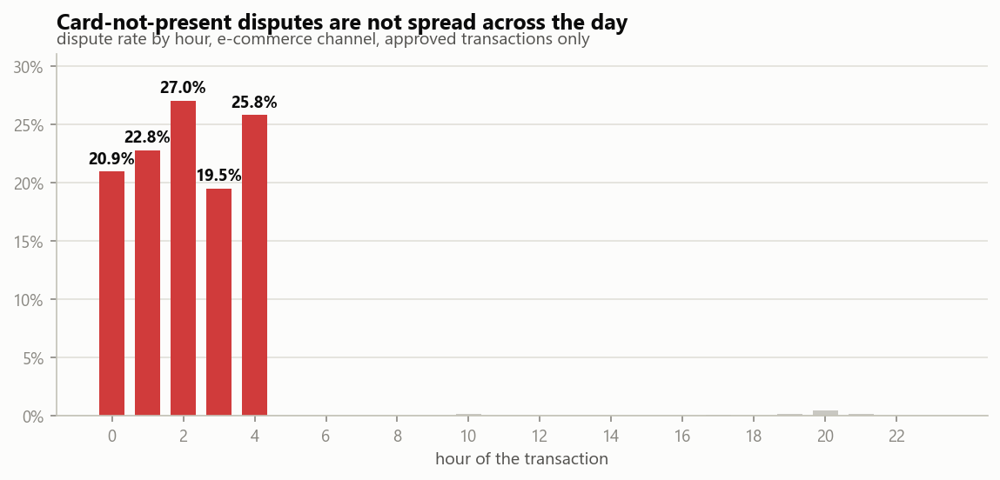
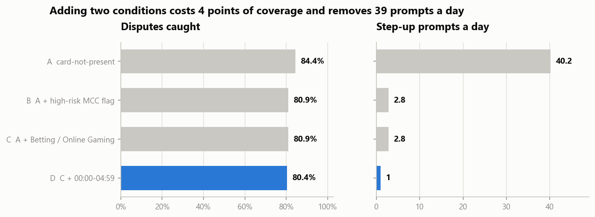
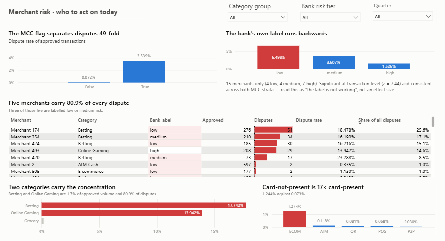
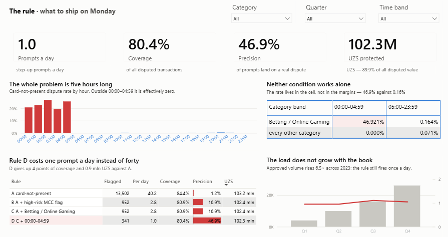

# UZCARD card payments — where the money leaks

**Analysis of 60,320 card transactions across 2,000 customers, 3,286 cards and 600
merchants over 2023.** PostgreSQL · Python · Power BI


<sub>Page 1 of three. The full report is [`dashboard/uzcard-payments.pbix`](dashboard/uzcard-payments.pbix);
the spec it was built from is [`dashboard/README.md`](dashboard/README.md).</sub>

**Interactive web version:** **[open it live](https://shahzodo5o4.github.io/data-analyst-portfolio/uzcard-payments-analysis/dashboard/web/)** — the three report pages with working filters, rebuilt from the raw fact data. Source: [`dashboard/web/index.html`](dashboard/web/index.html).

---

## The answer first

Two leaks, sized on the same axis so they can be ranked: **102.4 mln UZS of disputed
volume** sits in card-not-present Betting and Online Gaming, and **16.2 mln UZS of declines**
sits in one defective card product. The dispute leak is worth **6.3×** the decline leak and
is the cheaper of the two to fix — a step-up rule that fires on **0.61% of approved volume,
one prompt a day, at 46.9% precision**. Both figures are exposure, not booked loss; the
assumption is spelled out in [Method notes](#method-notes).

## The headline

Three findings, each of which contradicts the answer you get from the obvious query.

**1. There is no student problem. There is a virtual-card-for-students problem.**

Grouping declines by customer segment says students fail twice as often as anyone else
(11.19% vs 5.8%) — an apparently clear case for tightening student credit. Crossing
segment against card product tier shows that conclusion is a Simpson's paradox:

| | virtual card | other card |
|---|---:|---:|
| **student** | **20.23%** | 5.69% |
| everyone else | 5.86% | 5.83% |


Students holding a normal card decline at 5.69% against 5.83% for non-students —
a gap of −0.14 points, p = 0.80. **Statistically indistinguishable.** Virtual cards held
by anyone other than a student are equally unremarkable at 5.86%. Only the intersection
misbehaves, and it misbehaves badly: 227 declines on 1,122 transactions, +14.40 points
over the rest of the book (z = 19.97, 95% CI [12.04, 16.76], p < 0.001).

It is not a few broken cards — 134 cards across 107 customers, median per-card decline
rate 20.0%, and 79 of the 127 cards with enough volume sit above 15%. It is not credit
limits — student virtual cards average a 1,223,838 UZS limit against 1,265,480 for
student standard cards. It is not the channel — the gap holds in all five. And it is not
an incident: 18.9% / 23.2% / 16.9% / 21.3% across the four quarters of 2023.

**What it is worth:** 162 declines the cell would not have had at the rest-of-book rate,
at its own average declined ticket of 100,231 UZS — **16.2 mln UZS a year**.

**2. The bank's merchant risk labelling is not just useless — inside the categories that
matter, it points the wrong way.**

Two risk labels exist in the data. The MCC-level `is_high_risk` flag separates disputes
49-fold. The bank's own per-merchant `risk_tier` does not:

| MCC stratum | labelled low | labelled medium | labelled high |
|---|---:|---:|---:|
| high-risk MCC | **6.498%** | 3.607% | **1.526%** |
| normal MCC | 0.086% | 0.046% | 0.027% |

The ordering is inverted in **both** strata. Inside high-risk MCCs the low-vs-high gap is
4.97 points (z = 7.44, p < 0.001). Merchants the bank flagged as its safest are the ones
generating the disputes.


The concentration is extreme: **five merchants out of 600 account for 80.9% of every
dispute in the book**, and the bank has three of those five labelled low or medium risk.


**3. "E-commerce is risky" is false. One five-hour window at two categories is risky.**

The hour of the transaction is the condition nobody cuts, and here it carries the finding.
Card-not-present disputes are not spread across the day — 160 of 168 of them happen
between 00:00 and 04:59.



Neither condition does this alone:

| | 00:00–04:59 | 05:00–23:59 |
|---|---:|---:|
| **Betting / Online Gaming** | **46.921%** | 0.164% |
| every other category | 0.000% | 0.071% |

The same merchants during the day dispute at 0.164%; every other category at night is at
zero; every card-present channel is flat across the clock (0 disputes on 1,170 night
transactions). The gap between the cell and the same merchants by day is 46.76 points
(z = 18.45, 95% CI [41.45, 52.06], p < 0.001). Nor is it the category restated — these
merchants trade around the clock, and night is 36% of their volume against 99.4% of their
disputes.

Strip that one cell out and **card-not-present is safer than card-present**: 0.061% against
0.073%. Blanket friction on e-commerce would tax 13,161 clean transactions to reach 8
disputes.

That is what makes the rule cheap. Scored against the alternatives on the cost side —
every flagged transaction is a prompt shown to a real customer:

| rule | flagged | prompts/day | disputes covered | precision | protected |
|---|---:|---:|---:|---:|---:|
| A card-not-present | 13,502 | 40.2 | 84.4% | 1.2% | 103.2 mln |
| B A + high-risk MCC flag | 952 | 2.8 | 80.9% | 16.9% | 102.4 mln |
| C A + Betting / Online Gaming | 952 | 2.8 | 80.9% | 16.9% | 102.4 mln |
| **D C + 00:00–04:59** | **341** | **1.0** | **80.4%** | **46.9%** | **102.3 mln** |



Rule D gives up 4 points of coverage against the blanket rule and removes 39 of its 40
daily prompts. Two results are worth stating rather than hiding: B and C are identical
because Crypto/FX and Money Transfer never settle on ECOM, so requiring card-not-present
already excludes them; and a fifth rule — the five named merchants, same window — selects
*exactly* the same 341 transactions as D, so naming merchants buys nothing over naming
categories and would need re-cutting on every onboarding.

---

## What to do about it

Ranked by money at stake, which is the reverse of the order the findings arrive in above.

1. **Ship rule D — 102.4 mln UZS, one prompt a day.** Step-up authentication on
   card-not-present Betting and Online Gaming between 00:00 and 04:59. Name the two
   categories rather than the `is_high_risk` flag: Crypto/FX (1 dispute on 2,857 approved)
   and Money Transfer (0 on 768) are clean and make up 79% of what the flag covers. Add
   the window and the target narrows to 0.61% of approved volume at 46.9% precision, still
   protecting 89.9% of all disputed value. This is the cheapest of the four options on the
   table and the largest amount of money.

2. **Audit the student virtual card product — 16.2 mln UZS.** The decline gap is 3.5× and
   lives in one product cell. Every other student card performs normally, so this is a
   product defect to be found and fixed, not a credit policy to be tightened. Tightening
   student limits — the action the segment-level number implies — would hit all 209
   students, including the 102 who hold no virtual card at all and decline at the same rate
   as everyone else, while leaving the actual defect in place.

3. **Rebuild `risk_tier` or retire it.** No money is attached to this one directly, which
   is why it ranks third — but a label that inverts inside the segment where it matters is
   worse than no label, because it routes review capacity away from the merchants that need
   it. Three of the five merchants carrying the exposure are labelled low or medium.

4. **Do not fund card-not-present capacity — the answer to that question is already no.**
   E-commerce is the only channel gaining share (17.0% of Q1 volume to 28.5% of Q4, +11.6
   points, taken mostly from POS at −7.5), so the natural ask is a bigger review queue. The
   data says it is not needed: across the four quarters of 2023 the book grew 6.5× and rule
   D's load stayed at **1.0 / 1.0 / 1.1 / 1.0 flagged transactions a day**, because the
   exposure is anchored to five merchants whose own volume is flat. Dispute value rose 29%
   while volume rose 550%. The thing to monitor is not e-commerce growth — it is whether a
   sixth merchant ever joins the five.


---

## The report

Three pages, each written for a different reader. The split is deliberate: a single page
that tries to serve the P&L owner and the anti-fraud analyst at once serves neither.

**Page 1 — Overview** *(above)*. For whoever owns the P&L. One question: is anything
wrong, and how big is it? The decline chart sits beside the segment chart that most
people would have built, because showing the misleading view next to the correct one is
the argument.

**Page 2 — Merchant risk.** For the anti-fraud analyst who has to act before lunch. The
watchlist is the operational output; the caveat about 15 merchants is printed on the page
rather than left in a footnote, because a dashboard that shows only the flattering half
of a finding is how a wrong decision gets made six months later.



**Page 3 — The rule.** For whoever approves the rule and staffs the queue it creates. It
carries the money and the operating cost, which is what turns "80.9% of disputes sit
here" into something someone can sign off.



The report reads a star schema of six views rather than the raw tables, so "dispute rate"
means disputes over *approved* transactions everywhere and no visual can quietly redefine
it. Those views end in six smoke tests that assert the numbers in this README; if a view
is edited and the tests drift, the dashboard is quoting something the analysis never said.

Design decisions — palette, grid, the rule that exactly one thing per page may be red —
are written down in [`dashboard/DESIGN-PHILOSOPHY.md`](dashboard/DESIGN-PHILOSOPHY.md)
and drawn in [`dashboard/uzcard-design-plates.pdf`](dashboard/uzcard-design-plates.pdf).

---

## How to read this repo

```
sql/
  01-baseline.sql          what normal looks like — every later number is judged against this
  02-decline-drivers.sql   the Simpson's paradox, built up in nine steps
  03-dispute-risk.sql      the two risk labels, tested against each other
  04-channel-shift.sql     growth measured as share, not as raw month-over-month
  05-rule-design-and-impact.sql
                           the hour of the transaction, the rule scored on operating
                           load, and both findings converted to UZS
notebooks/
  01-analysis.ipynb        the same analysis with charts and the significance tests
dashboard/
  views.sql                star-schema views the report reads — not the raw tables,
                           ending in six smoke tests that assert this README's numbers
  README.md                the Power BI build spec: model, measures, all three pages
  uzcard-payments.pbix     the report itself
  theme.json               palette and type ramp, loaded once before any visual
  DESIGN-PHILOSOPHY.md     the design system the pages are built to
assets/                    notebook charts (01-09, 12-13) and report screenshots (10, 11, 14)
```

Each SQL file runs standalone and prints its own results:

```bash
psql -d portfolio -f sql/02-decline-drivers.sql
```

## Reproducing it

```bash
cp .env.example .env                                  # then fill in PGPASSWORD
python setup/load_data.py                             # builds the database from data/raw/
python setup/profile_data.py                          # the data-quality scan
psql -d portfolio -f uzcard-payments-analysis/dashboard/views.sql   # dashboard model
```

The first two scripts live at the repo root and cover all four portfolio projects — this
one occupies the `uzcard` schema. `views.sql` ends with smoke tests that assert the
dashboard model still reproduces the numbers in this README.

---

## Method notes

**Approved-only denominators for disputes.** A declined payment never settles, so it
cannot be disputed. Dividing disputes by all transactions would deflate every rate by
roughly 7%.

**Channel, not entry mode.** `entry_mode` collapses ATM withdrawals, P2P transfers and
chip-at-POS into a single `chip` bucket — three behaviours with a 4× spread in median
ticket size. `terminals.channel` keeps them apart, and every finding here is cut that
way. The two columns agree perfectly where they overlap (every ECOM terminal maps to
`ecom_cvv`), so nothing is lost by preferring the richer one.

**Share, not growth rate.** The customer book onboards throughout 2023, so every channel
"grows" 12–35× and the number means nothing. Channel movement is measured as share of
monthly volume, which is immune to the size of the book.

**Monthly, never daily.** 26 calendar days are missing from 2023, spread evenly across
weekdays — random sparsity in the source, not an outage. A daily series would show dips
that are not real. See [`setup/DATA-QUALITY.md`](../setup/DATA-QUALITY.md).

**Exposure, not loss.** Both money figures are upper bounds, and they are labelled that
way wherever they appear. The dispute figure is disputed *volume* — some of it would be
resolved in the bank's favour, but there is no dispute outcome in the data. The decline
figure values excess declines at the cell's own average declined ticket — a customer who
succeeds on a retry is still counted, because there is no retry linkage. These are the
right numbers for ranking two fixes against each other and the wrong numbers for a P&L
line.

**Per-day loads use the 336 observed days**, not 365 — the same missing-days correction as
above, applied to the operating-cost side of the rule.

## Limitations

- **Synthetic course data.** Internally consistent and structurally clean — 35 of 35
  parent/child relationships have zero orphan rows — but it is generated, so the
  behavioural findings demonstrate method rather than describing a real market.
- **The 00:00–04:59 window is cleaner than real behaviour ever is.** A rate that goes from
  46.9% to 0.16% at a clock boundary, with nothing in between, is the signature of a
  generator. In a real book expect a gradient, so the method transfers — cut the hour, test
  the interaction, score the rule on load — while these five specific hours do not. Re-fit
  the window before using it anywhere.
- **Rule D is scored on the year it was fitted on.** Coverage, precision and load are all
  in-sample. The honest next step is a holdout period, which one year of data cannot
  provide.
- **The inverted `risk_tier` rests on 15 merchants.** The high-risk MCC stratum contains
  4 low, 4 medium and 7 high-tier merchants. The inversion is significant at transaction
  level and consistent in direction across both strata, but the merchant count is small.
  Read it as "this label is not working", not as a precise effect size.
- **`is_disputed` is a flag, not a lifecycle.** The transaction amount is there, so the
  volume at stake can be sized — but there is no resolution or chargeback outcome, so the
  realised cost of the concentration cannot be.
- **One year, one issuer.** No seasonality baseline to compare 2023 against.
- **No causal claim.** The student virtual card finding survives controls for credit
  limit, channel, quarter and per-card distribution, but this is observational data —
  it locates the defect, it does not explain the mechanism.
