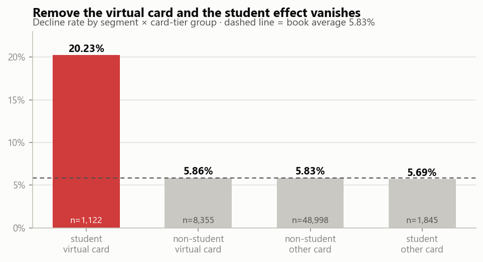
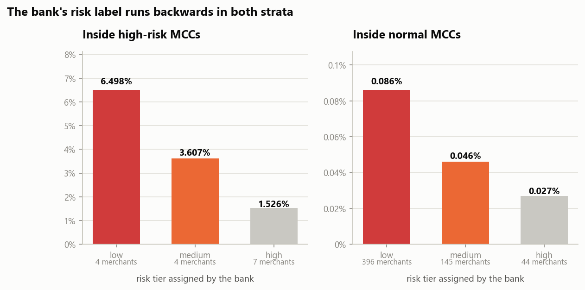
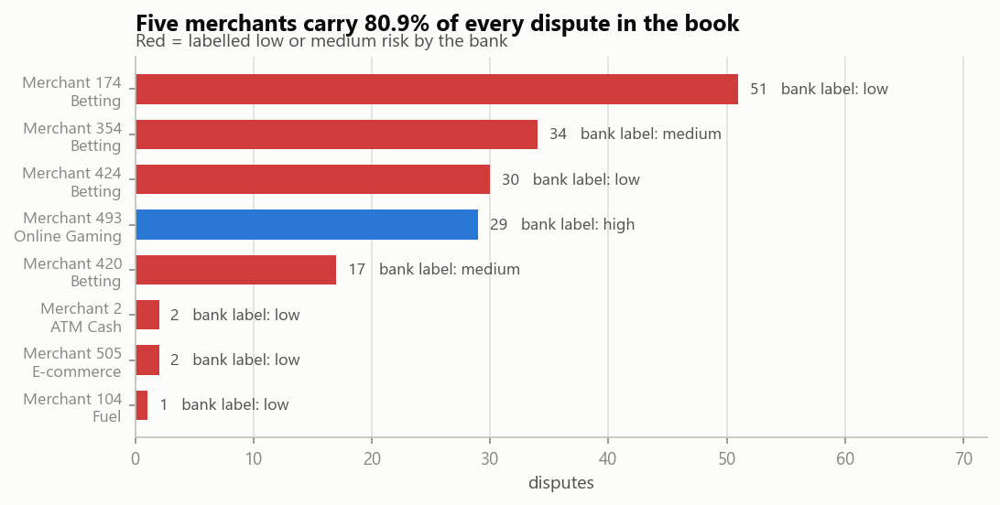
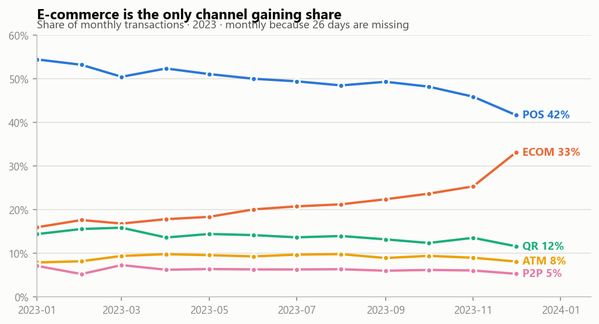

# UZCARD card payments — where the money leaks

**Analysis of 60,320 card transactions across 2,000 customers, 3,286 cards and 600
merchants over 2023.** PostgreSQL · Python · matplotlib

---

## The headline

Two findings, both of which contradict the answer you get from the obvious query.

**1. There is no student problem. There is a virtual-card-for-students problem.**

Grouping declines by customer segment says students fail twice as often as anyone else
(11.19% vs 5.8%) — an apparently clear case for tightening student credit. Crossing
segment against card product tier shows that conclusion is a Simpson's paradox:

| | virtual card | other card |
|---|---:|---:|
| **student** | **20.23%** | 5.69% |
| everyone else | 5.86% | 5.83% |



Students holding a normal card decline at 5.69% against 5.83% for non-students —
a gap of −0.14 points, p = 0.80. **Statistically indistinguishable.** Virtual cards held
by anyone other than a student are equally unremarkable at 5.86%. Only the intersection
misbehaves, and it misbehaves badly: 227 declines on 1,122 transactions, +14.40 points
over the rest of the book (z = 19.97, 95% CI [12.04, 16.76], p < 0.001).

It is not a few broken cards — 134 cards across 107 customers, median per-card decline
rate 20.0%, and 79 of the 127 cards with enough volume sit above 15%. It is not credit
limits — student virtual cards average a 1,223,838 UZS limit against 1,265,480 for
student standard cards. It is not the channel — the gap holds in all five. And it is not
an incident: 18.9% / 23.2% / 16.9% / 21.3% across the four quarters of 2023.

**2. The bank's merchant risk labelling is not just useless — inside the categories that
matter, it points the wrong way.**

Two risk labels exist in the data. The MCC-level `is_high_risk` flag separates disputes
49-fold. The bank's own per-merchant `risk_tier` does not:

| MCC stratum | labelled low | labelled medium | labelled high |
|---|---:|---:|---:|
| high-risk MCC | **6.498%** | 3.607% | **1.526%** |
| normal MCC | 0.086% | 0.046% | 0.027% |

The ordering is inverted in **both** strata. Inside high-risk MCCs the low-vs-high gap is
4.97 points (z = 7.44, p < 0.001). Merchants the bank flagged as its safest are the ones
generating the disputes.



The concentration is extreme: **five merchants out of 600 account for 80.9% of every
dispute in the book**, and the bank has three of those five labelled low or medium risk.



---

## What to do about it

1. **Audit the student virtual card product.** The decline gap is 3.5× and lives in one
   product cell. Every other student card performs normally, so this is a product defect
   to be found and fixed, not a credit policy to be tightened. Tightening student limits —
   the action the segment-level number implies — would hit all 209 students, including the
   102 who hold no virtual card at all and decline at the same rate as everyone else,
   while leaving the actual defect in place.

2. **Name two categories, not a flag.** The `is_high_risk` MCC flag covers four
   categories, but Crypto/FX (1 dispute on 2,857 approved) and Money Transfer (0 on 768)
   are clean and make up 79% of the flagged volume. Betting and Online Gaming alone are
   **1.7% of approved volume and 80.9% of disputes**. Step-up authentication scoped to
   those two gets the same coverage with a fifth of the friction.

3. **Rebuild `risk_tier` or retire it.** A label that inverts inside the segment where it
   matters is worse than no label, because it routes review capacity away from the
   merchants that need it.

4. **Watch e-commerce.** It is the only channel gaining share — 17.0% of Q1 volume to
   28.5% of Q4, +11.6 points, taken mostly from POS (−7.5). It is also the channel that
   produces 84.4% of all disputes, at 1.244% against 0.073% for card-present. The
   fastest-growing channel is the riskiest one, and the mix is still moving.



---

## How to read this repo

```
sql/
  01-baseline.sql          what normal looks like — every later number is judged against this
  02-decline-drivers.sql   the Simpson's paradox, built up in nine steps
  03-dispute-risk.sql      the two risk labels, tested against each other
  04-channel-shift.sql     growth measured as share, not as raw month-over-month
notebooks/
  01-analysis.ipynb        the same analysis with charts and the significance tests
```

Each SQL file runs standalone and prints its own results:

```bash
psql -d portfolio -f sql/02-decline-drivers.sql
```

## Reproducing it

```bash
cp .env.example .env          # then fill in PGPASSWORD
python setup/load_data.py     # builds the database from data/raw/
python setup/profile_data.py  # the data-quality scan
```

Both scripts live at the repo root and cover all four portfolio projects — this one
occupies the `uzcard` schema.

---

## Method notes

**Approved-only denominators for disputes.** A declined payment never settles, so it
cannot be disputed. Dividing disputes by all transactions would deflate every rate by
roughly 7%.

**Channel, not entry mode.** `entry_mode` collapses ATM withdrawals, P2P transfers and
chip-at-POS into a single `chip` bucket — three behaviours with a 4× spread in median
ticket size. `terminals.channel` keeps them apart, and every finding here is cut that
way. The two columns agree perfectly where they overlap (every ECOM terminal maps to
`ecom_cvv`), so nothing is lost by preferring the richer one.

**Share, not growth rate.** The customer book onboards throughout 2023, so every channel
"grows" 12–35× and the number means nothing. Channel movement is measured as share of
monthly volume, which is immune to the size of the book.

**Monthly, never daily.** 26 calendar days are missing from 2023, spread evenly across
weekdays — random sparsity in the source, not an outage. A daily series would show dips
that are not real. See [`setup/DATA-QUALITY.md`](../setup/DATA-QUALITY.md).

## Limitations

- **Synthetic course data.** Internally consistent and structurally clean — 35 of 35
  parent/child relationships have zero orphan rows — but it is generated, so the
  behavioural findings demonstrate method rather than describing a real market.
- **The inverted `risk_tier` rests on 15 merchants.** The high-risk MCC stratum contains
  4 low, 4 medium and 7 high-tier merchants. The inversion is significant at transaction
  level and consistent in direction across both strata, but the merchant count is small.
  Read it as "this label is not working", not as a precise effect size.
- **`is_disputed` is a flag, not a lifecycle.** There is no resolution, chargeback
  outcome or dispute amount, so the cost of the dispute concentration cannot be sized.
- **One year, one issuer.** No seasonality baseline to compare 2023 against.
- **No causal claim.** The student virtual card finding survives controls for credit
  limit, channel, quarter and per-card distribution, but this is observational data —
  it locates the defect, it does not explain the mechanism.
